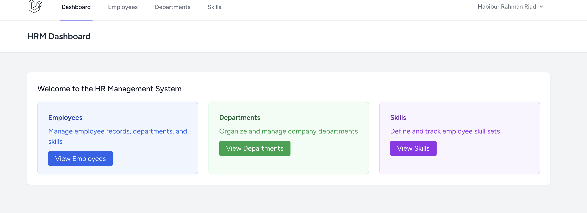
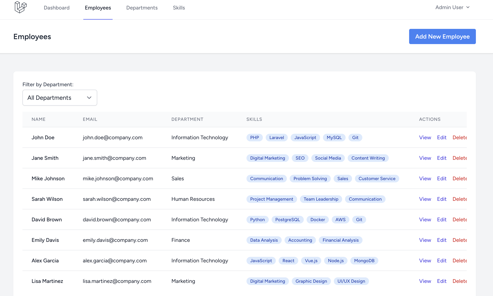
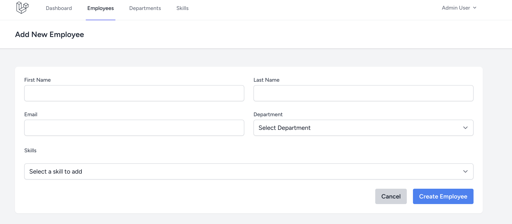
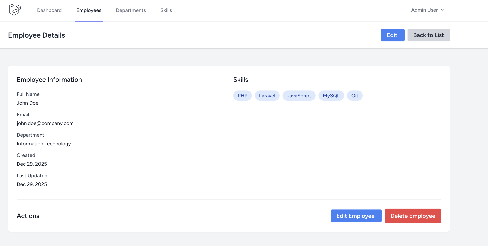
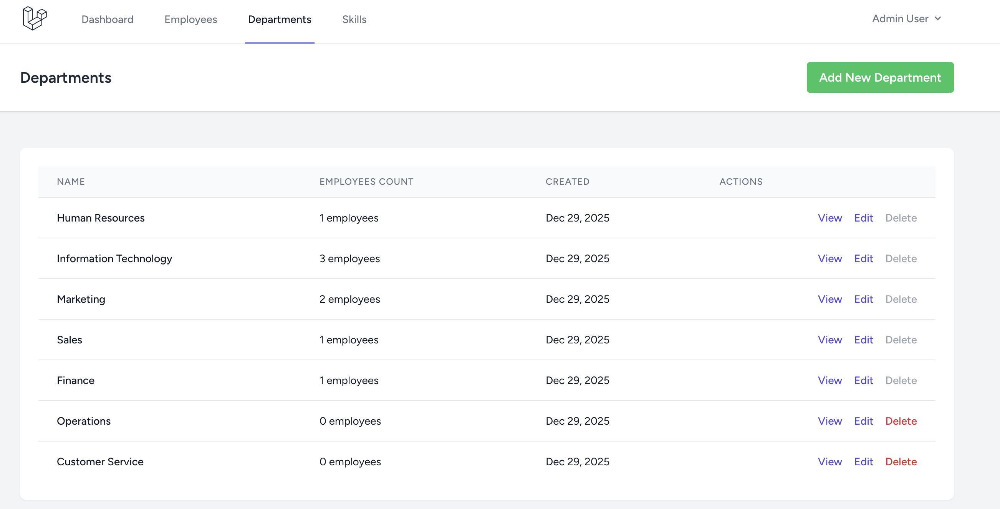
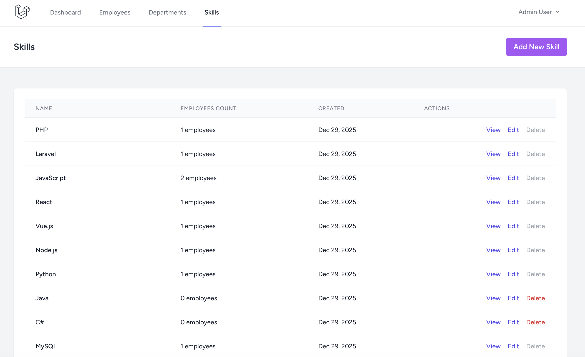

# Laravel HRM (Human Resource Management) System

A modern, feature-rich Human Resource Management system built with Laravel 11, featuring comprehensive employee management, department organization, and skill tracking capabilities.



## 🚀 Features

- **Employee Management**: Complete CRUD operations for employee records
- **Department Management**: Organize employees by departments
- **Skill Management**: Track and assign skills to employees
- **Authentication**: Secure login/logout with Laravel Breeze
- **AJAX Filtering**: Real-time employee filtering by department
- **Responsive Design**: Modern UI with Tailwind CSS
- **Form Validation**: Comprehensive server-side validation
- **Service Layer Architecture**: Clean separation of business logic
- **Comprehensive Testing**: 134+ test cases with full coverage

## 🛠️ Technology Stack

### Backend
- **Laravel 11** - PHP Framework
- **PHP 8.2+** - Programming Language
- **MySQL** - Database
- **Laravel Breeze** - Authentication scaffolding

### Frontend
- **Blade Templates** - Server-side templating
- **Tailwind CSS** - Utility-first CSS framework
- **Alpine.js** - Lightweight JavaScript framework
- **jQuery** - JavaScript library for AJAX

### Development & Testing
- **PHPUnit** - Testing framework
- **Laravel Factories** - Test data generation
- **Composer** - Dependency management
- **Artisan** - Command-line interface

## 📋 Requirements

- PHP 8.2 or higher
- Composer
- Node.js & NPM
- MySQL 8.0 or higher
- Git

## 🔧 Installation

### 1. Clone the Repository

```bash
git clone https://github.com/riad1302/HRM.git
cd HRM
```

### 2. Install PHP Dependencies

```bash
composer install
```

### 3. Install Node Dependencies

```bash
npm install
```

### 4. Environment Setup

```bash
# Copy environment file
cp .env.example .env

# Generate application key
php artisan key:generate
```

### 5. Configure Database

Edit the `.env` file with your database credentials:

```env
DB_CONNECTION=mysql
DB_HOST=127.0.0.1
DB_PORT=3306
DB_DATABASE=hrm_database
DB_USERNAME=your_username
DB_PASSWORD=your_password
```

### 6. Database Migration & Seeding

```bash
# Run migrations
php artisan migrate

# Seed database with sample data (optional)
php artisan db:seed
```

### 7. Build Assets

```bash
# Compile CSS and JS assets
npm run build

# For development with file watching
npm run dev
```

### 8. Start Development Server

```bash
php artisan serve
```

The application will be available at `http://localhost:8000`

## 🔑 Login Credentials

After running the database seeder, you can login with:
- **Email**: `admin@hrm.com`
- **Password**: `password`

## 🗄️ Database Schema

### Tables
- **users** - System users with authentication
- **departments** - Company departments
- **skills** - Available skills in the system
- **employees** - Employee records
- **employee_skill** - Many-to-many relationship between employees and skills

### Relationships
- Employee belongs to Department (One-to-Many)
- Employee has many Skills (Many-to-Many)
- Department has many Employees (One-to-Many)

## 🧪 Testing

Run the comprehensive test suite:

```bash
# Run all tests
php artisan test

# Run specific test categories
php artisan test tests/Feature/EmployeeTest.php
php artisan test tests/Unit/EmployeeServiceTest.php

# Run tests with coverage
php artisan test --coverage
```

### Test Coverage
- **134 tests** with **371 assertions**
- Feature tests for all CRUD operations
- Unit tests for service layer
- Form validation tests
- AJAX endpoint tests
- Authentication tests

## 📸 Screenshots

### Employee Management

*Employee listing with department filtering and search functionality*


*Create new employee with department and skills assignment*


*Detailed employee view with all information and relationships*

### Department Management

*Department overview with employee counts*

### Skill Management

*Skills management with employee assignments*


## 🏗️ Architecture

### Service Layer Pattern
The application follows a clean service layer architecture:

- **Controllers**: Handle HTTP requests and responses
- **Services**: Contain business logic and data manipulation
- **Form Requests**: Handle validation rules
- **Models**: Eloquent ORM models with relationships

### File Structure
```
app/
├── Http/
│   ├── Controllers/     # Request handling
│   └── Requests/        # Form validation
├── Models/             # Eloquent models
└── Services/           # Business logic

tests/
├── Feature/            # Integration tests
└── Unit/              # Unit tests

resources/
├── views/             # Blade templates
└── js/                # Frontend assets
```


## 👨‍💻 Author

**Habibur Rahman Riad**
- GitHub: [@riad1302](https://github.com/riad1302)
- LinkedIn: [Habibur Rahman Riad](https://linkedin.com/in/habibur-rahman-riad)

Made with ❤️ using Laravel 11
